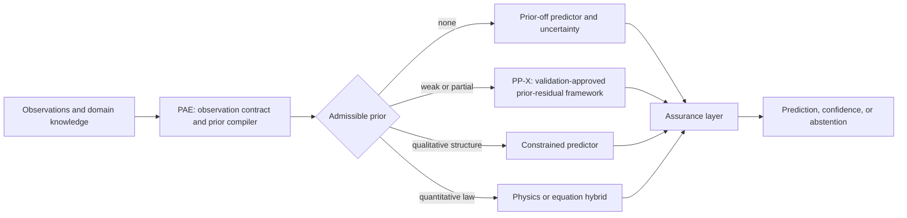

# pp_pae_total — PP-X / Assumption-Aware Extrapolation

This repository is the integration hub for **PP-X**, the first-paper main method, and the broader assumption-aware extrapolation research program for RUL, degradation, crack growth, and related scientific time-series problems.

The program treats extrapolation as an assumption-management problem:

1. **Compile** only the structural priors justified by what is observed.
2. **Execute** those priors without allowing a flexible residual network to overturn them outside support.
3. **Assure** each prediction through support geometry, validation error transport, uncertainty, and abstention when evidence is insufficient.

## Research modules

| Module | Role | Status |
|---|---|---|
| PP-X | Paper-main top-level framework: validates a prior-residual candidate, selects only supported executors, and falls back or abstains when evidence is insufficient. | Current first-paper stage |
| SAAR | Historical alias and core architecture for the support-aware affine-residual mechanism; not the paper-main method name. | Historical mechanism / stress-test |
| CCMR v2.2 | Trajectory-domain executor used only when trajectory evidence supports it. | Optional PP-X executor |
| PAE | Compiles the admissible prior from a typed observation contract and routes among strong, weak, and prior-off executors. | Follow-up paper stage |
| Assurance | Reports support distance, validation error transport, uncertainty, coverage, and abstention. | PP-specific implementation; cross-executor generalization is future work |

## Why separate PP and PAE papers?

PP-X asks: **given a candidate weak prior, can a validation-approved prior-residual framework execute it safely for strict extrapolation, or should it fall back/abstain?**

PAE asks: **from available observations, which prior is admissible, and when should the system turn that prior off?**

PP-X is therefore the independent paper-main result, not an unfinished PAE implementation. PAE is a future program and may route to PP-X; it is not the current paper main.

## Final model boundary

- **PP-X** is the paper-main top-level framework.
- **SAAR** remains a historical alias/core-architecture label where needed for artifact traceability.
- **CCMR v2.2** is a trajectory-domain executor only, not the main model.
- **CRT** and **GCIE** were evaluated and rejected; they are not part of Algorithm 1.
- On DS03, frozen PP-X fallback achieved R² 0.8818 and Engression achieved 0.9013: route selection passed, but predictive superiority failed.
- If a candidate prior is rejected, PP-X uses the declared fallback or abstains.

Canonical naming is documented in [`slides/pp_research/PPX_NAMING.md`](slides/pp_research/PPX_NAMING.md). Legacy filenames are retained for reference stability.

## Scope and claims

The framework does not invent a physical law for an unknown domain. When no structural prior is justified, it routes to a prior-off predictor and reports uncertainty or abstains. A formula is the strongest type of prior; boundaries, monotonic direction, history, and support geometry are weaker priors.

See [the Korean research-program document](RESEARCH_PROGRAM_KO.md) for the full motivation, paper boundaries, prior ladder, and experimental agenda.

## Repositories

- PP executor: `amumujs-create/pp-extrapolation`
- PAE compiler: repository to be linked after its independent paper package is frozen
- Literature map: `amumujs-create/literec_study`

## Planned evidence

1. Freeze PP and report pooled R², per-unit coverage, support shells, and seed robustness.
2. Evaluate PAE with correct-prior, deliberately wrong-prior, prior-off, and PAE-routed conditions.
3. Test across domains whose admissible priors differ, rather than merely swapping datasets.
4. Quantify selective risk and coverage for support-remote predictions.

## Presentations

- PP–PAE overview deck: `output/PP_PAE_Assumption_Aware_Extrapolation_v7.pptx` (builder: `slides/build_deck.mjs`)
- PP-X paper-main detailed briefing: `output/PP_Research_Detailed_v2.pptx` (builder: `slides/pp_research/`)

Edit the fixed deck files in place; do not create parallel v3+ copies of the detailed briefing.

## Status

This repository documents the research program. It does not claim that the full compiler–executor–assurance stack has already been implemented or externally validated.
