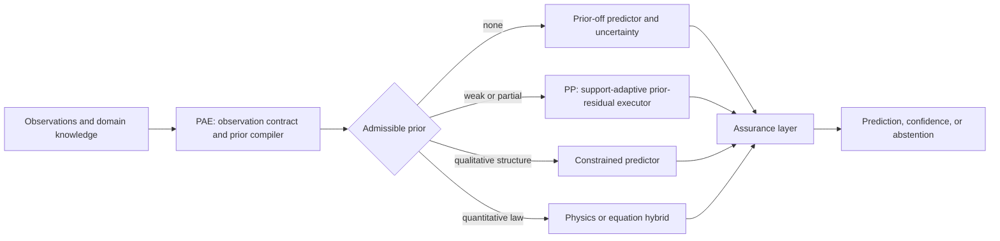

# pp_pae_total — Assumption-Aware Extrapolation

This repository is the integration hub for a research program on **assumption-aware extrapolation** for RUL, degradation, crack growth, and related scientific time-series problems.

The program treats extrapolation as an assumption-management problem:

1. **Compile** only the structural priors justified by what is observed.
2. **Execute** those priors without allowing a flexible residual network to overturn them outside support.
3. **Assure** each prediction through support geometry, validation error transport, uncertainty, and abstention when evidence is insufficient.

## Research modules

| Module | Role | Status |
|---|---|---|
| PP | Executes a declared weak prior with a frozen extrapolative tail and a bounded, support-adaptive history residual. | Current first-paper stage |
| PAE | Compiles the admissible prior from a typed observation contract and routes among strong, weak, and prior-off executors. | Follow-up paper stage |
| Assurance | Reports support distance, validation error transport, uncertainty, coverage, and abstention. | PP-specific implementation; cross-executor generalization is future work |

## Why separate PP and PAE papers?

PP asks: **given a weak prior that is already admissible, how can a neural residual use it safely for strict extrapolation?**

PAE asks: **from available observations, which prior is admissible, and when should the system turn that prior off?**

PP is therefore an independent first result, not an unfinished PAE implementation. PAE will use PP as one possible weak-prior executor.

## Scope and claims

The framework does not invent a physical law for an unknown domain. When no structural prior is justified, it routes to a prior-off predictor and reports uncertainty or abstains. A formula is the strongest type of prior; boundaries, monotonic direction, history, and support geometry are weaker priors.

See [the Korean research-program document](RESEARCH_PROGRAM_KO.md) for the full motivation, paper boundaries, prior ladder, and experimental agenda.

## Repositories

- PP executor: `amumujs-create/pp-extrapolation`
- PAE compiler: repository to be linked after its independent paper package is frozen
- Literature map: `amumujs-create/literec_study`

## Planned evidence

1. Freeze PP and report pooled R², per-unit coverage, support shells, and seed robustness.
2. Evaluate PAE with correct-prior, deliberately wrong-prior, prior-off, and PAE-routed conditions.
3. Test across domains whose admissible priors differ, rather than merely swapping datasets.
4. Quantify selective risk and coverage for support-remote predictions.

## Status

This repository documents the research program. It does not claim that the full compiler–executor–assurance stack has already been implemented or externally validated.
