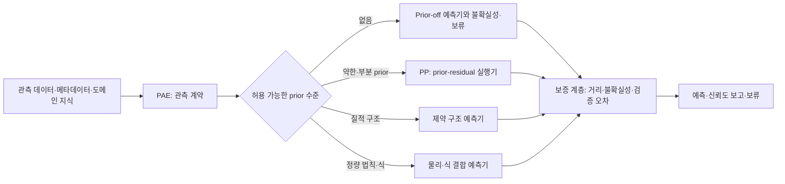

# 가정 인지형 외삽 연구 프로그램

## 한 문장

이 연구의 질문은 **관측된 데이터와 도메인 지식으로 정당화할 수 있는 가정만 선택하여, 그 가정을 외삽 예측기에 안전하게 실행하고, 근거가 부족하면 불확실성 또는 보류로 보고할 수 있는가**이다.

외삽은 단지 학습 범위 밖에서 점수가 높은 회귀 문제가 아니다. 학습 support 밖의 함수는 데이터만으로 식별되지 않으므로, 모든 외삽기는 명시적 또는 암묵적 가정을 사용한다. 연구의 기여는 하나의 보편식을 찾는 것이 아니라, **가정의 강도를 관측 가능 정보에 맞춰 조절하는 프레임워크**를 만드는 데 있다.

## 연구 모티베이션

RUL·열화·균열·용량 예측에서는 미래 구간, 새 개체, 새 운전 조건처럼 실제 배포에 가까운 외삽이 필요하다. 하지만 다음 두 접근 모두 불충분하다.

1. 일반 NN은 학습 support 밖에서 어떤 형태로 연장될지 제어하기 어렵다.
2. 물리식 또는 제약을 항상 강하게 넣으면, 식이 틀리거나 관측되지 않은 regime 변화가 있을 때 오히려 큰 편향을 만든다.

따라서 핵심은 “물리 prior를 넣을 것인가”가 아니다. **현재 과제에서 무엇을 실제로 알고 있는가, 그 지식으로 어떤 prior까지 허용되는가, 그 prior가 실패할 때 모델이 어떻게 축소·보류할 것인가**가 핵심이다.

식은 prior의 한 종류일 뿐이며 가장 강한 축에 속한다. 경계값, 부호, 단조 방향, 시간 이력, support 거리, 관측된 regime도 모두 더 약한 prior가 될 수 있다.

## 전체 프레임워크: Compile → Execute → Assure

이 그림은 박사과정 전체의 목표 구조다. 현재 모든 칸이 구현됐다는 뜻은 아니다. 현재 완료 단계는 PP의 약한·부분 prior 실행기이며, PAE는 다음 논문에서 prior 선택과 라우팅을 검증해야 한다.

### 1. Compile — PAE: 무엇을 모델에 넣어도 되는가

PAE는 데이터셋 이름이나 성능만 보고 식을 고르는 방법이 아니다. 입력 관측, 라벨, 경계, 시간 이력, 운전 조건, 알려진 메커니즘을 **typed observation contract**로 기록하고, 거기서 정당화되는 prior만 컴파일한다.

| 관측 가능한 지식 | 허용 prior | 예측기 예시 |
|---|---|---|
| 구조 지식 없음 | 구조 prior 없음 | prior-off NN + 불확실성/보류 |
| 범위·종단 경계·시간 이력 | 양수성, EOL 경계, 약한 tail, support | PP |
| 방향 또는 순서 지식 | 단조성, 부호, 부분 순서 | constrained / monotone 구조 |
| 알려진 관계식·보존식·동역학 | 정량 물리/수식 제약 | physics/equation residual hybrid |

PAE의 중요한 안전장치는 **prior-off 경로**다. 모르는 도메인에서 임의의 물리식을 발명하지 않는다. 어떤 prior도 관측으로 뒷받침되지 않으면 일반 예측과 불확실성 보고 또는 보류로 라우팅한다.

### 2. Execute — PP: 주어진 약한 prior를 어떻게 외삽에 안전하게 쓰는가

PP는 PAE보다 먼저 독립 논문으로 성립한다. PP의 입력은 “이 약한 prior는 허용된다”는 선언이며, PP의 질문은 **NN residual이 그 prior를 망가뜨리지 않게 하면서 유용한 보정을 얻는 법**이다.

현재 PP의 핵심 구조는 다음과 같다.

\[
\hat y=m\,\operatorname{softplus}(\ell(z)+c_\theta(z))
\]

여기서 \(\ell(z)\)는 고정한 affine tail, \(m\)은 경계 margin, \(c_\theta\)는 history residual이다. support에서 멀어질수록 residual의 두 포화 규모를 부드럽게 전환한다.

\[
c_\theta(z)=w(z)B_L\tanh(r_\theta(z))+
\{1-w(z)\}B_H\tanh\left(r_\theta(z)/B_H\right).
\]

따라서 PP는 다음 약속을 제공한다.

- EOL 경계를 정확히 보존한다.
- residual이 허용된 margin 밖으로 무한히 커지지 않는다.
- support 주변에서는 세밀한 history 보정을 쓰고, 멀어질수록 안정적 포화 보정으로 전환한다.
- 데이터셋 ID나 test label 없이 작동한다.

PP는 ‘prior-free’가 아니다. 경계·tail·residual envelope·support 거리를 약한 구조 prior로 명시한 방법이다. 이 정직한 표현이 논문에서 더 강하다.

### 3. Assure — 예측을 언제 믿고 언제 보류할 것인가

외삽 프레임워크의 마지막 층은 단일 R²가 아니다. support/hull 거리, validation에서 보인 오차 전달, seed 또는 uncertainty, coverage를 함께 이용해 예측의 적용 가능성을 보고한다.

현재 PP에서 이 층은 PP backbone에 대한 geometry 및 validation-error transport 검증으로 구현한다. 박사과정의 통합 단계에서는 이를 여러 executor가 공유하는 assurance interface로 확장할 수 있다. 이 일반화는 아직 주장할 결과가 아니라 후속 검증 과제다.

## 논문과 박사논문의 경계

### PP 논문: 첫 번째 독립 논문

**주장:** 선언된 약한 구조 prior 아래에서, strict out-of-support RUL 외삽을 위한 support-adaptive prior-residual executor를 제안한다.

- 대상: EOL 경계, 이력, 약한 affine tail처럼 이미 허용된 prior가 있는 문제
- 기여: frozen tail, bounded dual-scale residual, support-adaptive saturation, geometry-aware validation protocol
- 검증: 시간 끝단·처음 보는 unit/engine·조건 holdout에서 pooled R², unit coverage, seed robustness, support shell을 보고
- 비주장: prior를 자동으로 발견하거나, 모든 도메인의 참 물리식을 알아낸다는 주장

### PAE 논문: 두 번째 독립 논문

**주장:** 관측 계약에서 허용 prior를 컴파일하고, strong/weak/prior-off executor 중 적절한 경로를 선택하는 방법을 제안한다.

- 핵심 비교: correct prior, wrong prior, prior-off, PAE-selected prior
- 핵심 증거: prior가 있을 때만 이득을 얻고, prior가 없거나 틀리면 prior-off로 돌아가 손해를 제한함
- PP와의 관계: PP는 PAE가 선택할 수 있는 약한-prior executor 중 하나다.

### 박사논문: 통합 연구 프로그램

**가제:** *Assumption-Aware Extrapolation: Compiling, Executing, and Assuring Structural Priors*.

PAE가 가정의 허용 범위를 정하고, PP가 약한 prior를 안전하게 실행하며, assurance 계층이 적용 범위와 실패 가능성을 보고한다. 이후 물리식·regime 변화·새 도메인까지 prior ladder를 확장한다.

## 지금 단계의 해석

현재 연구가 PP까지 왔다는 것은 자연스러운 1단계다. PP만으로도 “아무 가정 없는 NN보다 약한 구조 prior를 어떻게 제어 가능한 외삽기로 만들 것인가”라는 분명한 논문 질문이 있다. PAE를 아직 완성하지 않았다고 해서 PP가 불완전한 것이 아니다.

다만 지금 단계에서 전체 프레임워크를 완성된 방법으로 논문에 주장하면 안 된다. 올바른 표현은 다음과 같다.

> PP는 가정 인지형 외삽의 실행 계층에 대한 첫 연구이며, PAE는 관측 계약 기반 prior 컴파일로 이를 일반 도메인에 확장하는 후속 연구다.

## 다음 실험의 최소 요건

1. **PP 고정:** 선택한 구조와 hyperparameter를 고정한 뒤, support shell·unit coverage·pooled R²·seed 분산을 같은 프로토콜로 재현한다.
2. **PAE failure-aware ablation:** correct prior / deliberately wrong prior / prior-off / PAE routing을 같은 데이터 분할에서 비교한다.
3. **교차 도메인 검증:** 배터리·균열·엔진처럼 prior 종류가 실제로 다른 도메인에서 ladder가 작동하는지 보인다. 단순한 데이터셋 교체가 아니라, 관측 계약과 선택 prior가 어떻게 달라졌는지 기록한다.
4. **보류의 정량화:** 높은 거리 또는 높은 불확실성에서 coverage와 risk를 보고한다. 모든 표본을 강제로 예측하는 것보다 위험을 낮추는지를 검증한다.

## 스토리에서 피할 표현

- “모르는 어떤 도메인에도 자동으로 맞는 prior를 찾는다.”
- “물리식을 넣으면 외삽이 보장된다.”
- “높은 평균 R² 하나로 외삽 능력을 증명했다.”

대신 다음처럼 쓴다.

> 외삽에는 가정이 필요하다. 본 연구는 가정을 숨기지 않고, 관측으로 정당화되는 수준만 사용하며, 그 가정의 적용 범위와 실패 신호를 함께 보고하는 학습 체계를 만든다.
